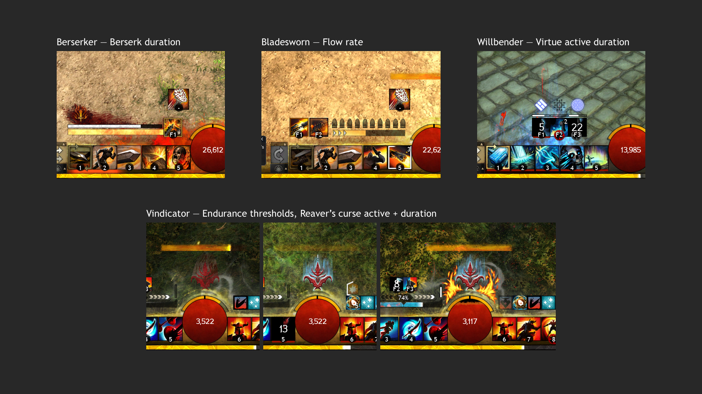
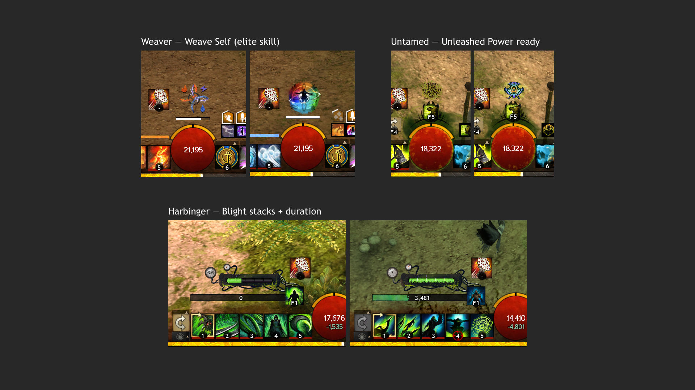

# Instinct

Reffect pack for Guild Wars 2. Requires https://github.com/Zerthox/gw2-reffect.

This pack covers some of the more important profession mechanics that are primarily relegated to the buff bar along that are sometimes hard to spot among all the other effects in there. These are mostly things that I have felt are missing after playing these classes, and I designed with a goal of matching the theme of the mechanic and feeling like a natural extension of the native UI.

**Note** that this pack is designed to fit into native UI elements and has been designed for the "Larger" UI size setting. Reffect offers a resize feature for packs that may help fitting it to the other UI sizes.

## Mechanics

- **Weaver**: Weave Self (elite skill)
- **Harbinger**: Blight
- **Untamed**: Unleashed Power ready
- **Willbender**: Virtue active effect durations
- **Vindicator**: Enhanced endurance indicator, Reaver's Curse
- **Berserker**: Berserk duration
- **Bladesworn**: Flow stacks

## Previews

